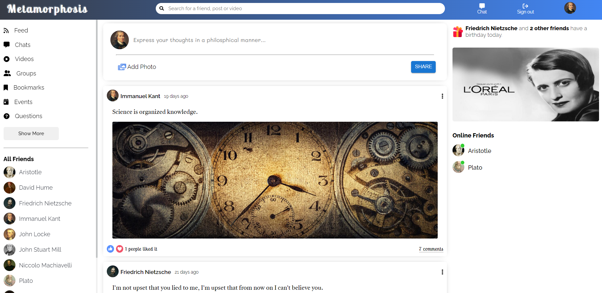

# Metamorphosis - Social Media App

[Metamorphosis App](https://seple.herokuapp.com)

## Features

- Authentication
- Chat
- Follow/Unfollow
- Like/Unlike
- Upload Post
- User Page

## Stack

- [MongoDB](https://www.mongodb.com) - NoSQL database
- [Express](https://expressjs.com) - Back end web application framework for Node.js
- [React.js](https://reactjs.org) - A JavaScript library for building user interfaces.
- [Node](https://nodejs.org/en/) - JavaScript runtime environment that executes JavaScript code outside a web browser.

## Project structure

```
$PROJECT_ROOT
+-- backend
|   +-- config                          // MongoDB Configuration
|   +-- controllers                     // Express Controllers
|   +-- models                          // Mongoose Models
|   +-- routes                          // Express Routes
+-- frontend
|   +-- public                          // Static Files
|   +-- src                             // App Root Folder
|   |   +-- components                  // React Components
|   |   +-- context                   	// Auth Context
|   |   +-- screens                     // Page Files
|   |   +-- App.js                      // App Compnent
|   |   +-- index.js                    // App Entry Point
+-- uploads                             // Uploaded Files

```

## Packages/Modules utilized

- **Backend**

		- bcryptjs					: enables storing of passwords as hashed passwords
		- colors       				: get colors in your node.js console
		- cors					: enable CORS with various options
		- dotenv                			: loads environment variables from .env file
		- helmet					: secure your Express apps by setting various HTTP headers 
		- morgan     					: HTTP request logger middleware for node.js
		- multer					: middleware for handling multipart/form-data i.e images
		- socket.io					: node.js realtime framework server.

- **Frontend**
    
		- axios                                    	: promise based HTTP client for the browser and Node.js
		- @fortawesome/react-fontawesome 		: Font Awesome React component using SVG with JS 
		- @mui/material 				: Material UI React components 
		- moment 					: date library for parsing, validating, manipulating, and formatting dates
		- sass 					: pure JavaScript implementation of Sass
		- socket.io-client 				: React realtime framework client

## Steps to Install & Run

1.  Clone the code from this repo
2.  Open terminal on frontend and backend folders and type `npm install #or yarn install`
3.  Run the development server `npm start #or yarn dev`

Open [http://localhost:3000](http://localhost:3000) with your browser to see the result.

## Homepage



